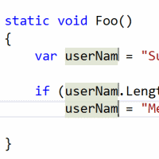

# Multi Edit Mode

Download this extension from the [VS Gallery](https://visualstudiogallery.msdn.microsoft.com/2beb9705-b568-45d1-8550-751e181e3aef)
or get the [CI build](http://vsixgallery.com/extension/MultiEdit..c6fb8e57-fde0-4987-8e7a-5ca9b4beddcb/).

---------------------------------------

Simultaneously edit in more than one location in the editor

If you've ever ran into a case where you wanted to quickly change variable names or multiple loop conditions - you can use *Multi Edit Mode* to set virtual carets that all behave the same.

## How to use

**ALT+Click** on different locations in your code to set multiple carets, and then type as you normally would.

## Features

* Better integration with Ctrl+Alt+Drag (column selection mode)
* Support for all languages
* Typing
* Pressing Enter / Backspacing / Deleting
* TABing, Shift-Tabbing
* Moving the caret around using the keyboard
* Pasting
* Intersected carets are removed
* Undo-ing
  
## What isn't supported:

* Multiple selections
* Virtual Spaces

## Contribute
Feel free to suggest new languages not currently supported by this
extension on the
[issue tracker](https://github.com/madskristensen/TextmateBundleInstaller/issues).
If you know a TextMate bundle that would work, then remember to add a
link to that as well.

Check out the [contribution guidelines](.github/CONTRIBUTING.md)
if you want to contribute to this project.

For cloning and building this project yourself, make sure
to install the
[Extensibility Tools 2015](https://visualstudiogallery.msdn.microsoft.com/ab39a092-1343-46e2-b0f1-6a3f91155aa6)
extension for Visual Studio which enables some features
used by this project.

## License
[Apache 2.0](LICENSE)
